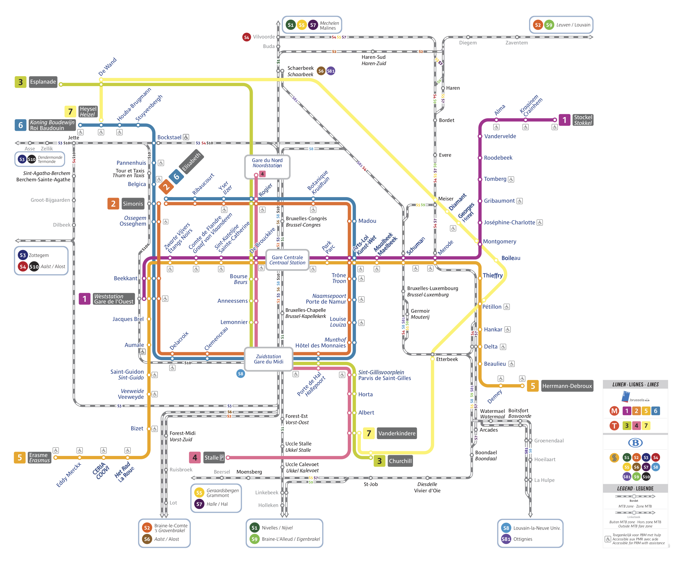

# Prolog# Paradigmas de Programação

## 1. Descrição

Projeto criado com intuito acadêmico. Objetiva-se desenvolver conceitos de linguagens lógicas a partir do Prolog.

### 1.1 Tema

Optou-se pelas viagens, linhas, conexões, tempo de viagem no metrô de Brouxellas, Bégica. A seguir segue a reprsentação desta linha do metrô.



## 2. Membros

* Andrew Lucas - 16/0023921
* Miguel Pimentel - 14/0156143
* Vitor Gomes - 15/0048106

## 3. Executando

* Para abir o console e utilizar o prolog:

````
  swipl
````

* Executar aplicação:

````
  [brouxelles_metro]. 
  menu(). 
````

## 4. Referências

* [SPMetro](https://github.com/bellthoven/spmetro)